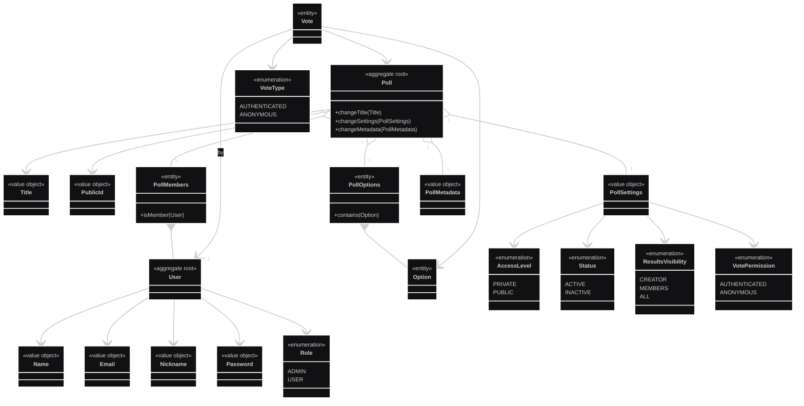

# 📊 PollrAPI

## Class diagram

```mermaid
---
config:
  theme: redux-dark
---
classDiagram

%% ==== AGGREGATES ====
class Poll {
  <<aggregate root>>
  +changeTitle(Title)
  +changeSettings(PollSettings)
  +changeMetadata(PollMetadata)
}

class User {
  <<aggregate root>>
}

class Vote {
  <<entity>>
}

%% ==== POLL SUPPORT ====
class Title {
  <<value object>>
}
class PublicId {
  <<value object>>
}

class PollOptions {
  <<entity>>
  +contains(Option)
}
class PollMembers {
  <<entity>>
  +isMember(User)
}
class PollSettings {
  <<value object>>
}
class PollMetadata {
  <<value object>>
}

class Option {
  <<entity>>
}

%% ==== USER VALUE OBJECTS ====
class Name {
  <<value object>>
}
class Email {
  <<value object>>
}
class Nickname {
  <<value object>>
}
class Password {
  <<value object>>
}

%% ==== ENUMS ====
class AccessLevel {
  <<enumeration>>
  PRIVATE
  PUBLIC
}
class Status {
  <<enumeration>>
  ACTIVE
  INACTIVE
}
class ResultsVisibility {
  <<enumeration>>
  CREATOR
  MEMBERS
  ALL
}
class VotePermission {
  <<enumeration>>
  AUTHENTICATED
  ANONYMOUS
}
class Role {
  <<enumeration>>
  ADMIN
  USER
}
class VoteType {
  <<enumeration>>
  AUTHENTICATED
  ANONYMOUS
}

%% ==== RELATIONSHIPS ====

Poll "1" o-- "1" PollOptions
Poll "1" o-- "1" PollMembers
Poll "1" o-- "1" PollMetadata
Poll "1" o-- "1" PollSettings
Poll --> Title
Poll --> PublicId

PollOptions *-- Option
PollMembers *-- User

Vote --> Poll
Vote --> Option
Vote --> "0..1" User : by

User --> Name
User --> Email
User --> Nickname
User --> Password
User --> Role

PollSettings --> AccessLevel
PollSettings --> VotePermission
PollSettings --> ResultsVisibility
PollSettings --> Status

Vote --> VoteType

```